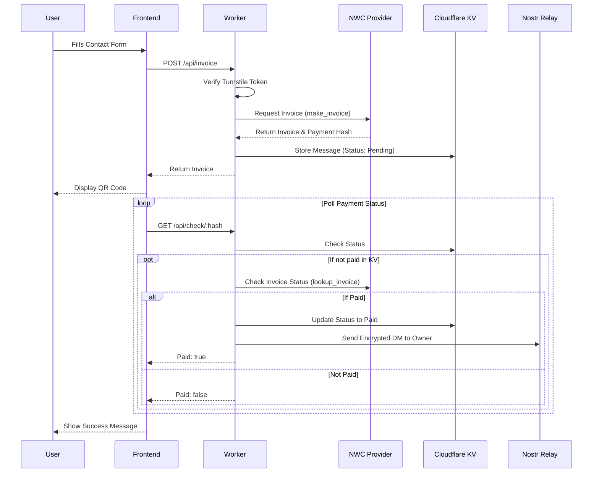
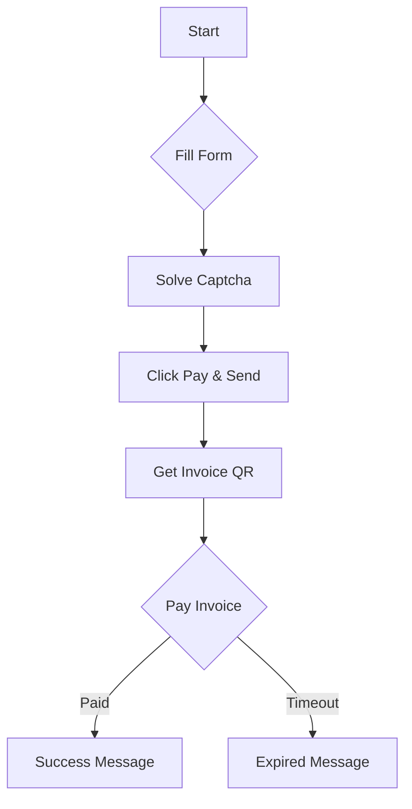

# PayMe - Paid Contact Form

PayMe is a Cloudflare Worker application that allows anyone to send you a message in exchange for a small Bitcoin Lightning Network payment. It uses Nostr Wallet Connect (NWC) to generate invoices and verify payments, and sends the message directly to you via a Nostr Direct Message (DM).

## Features

- **Paid Messaging**: Users must pay a small fee (in sats) to send a message.
- **Lightning Network**: Instant payments via Bitcoin Lightning Network using NWC.
- **Nostr Integration**: Messages are delivered as encrypted DMs to your Nostr pubkey.
- **Spam Protection**: Cloudflare Turnstile integration to prevent bot submissions.
- **Serverless**: Runs entirely on Cloudflare Workers with KV storage.

## Architecture

The application consists of a frontend (served by the Worker) and a backend API.



### User Flow



## Prerequisites

- **Cloudflare Account**: You need a Cloudflare account to deploy the Worker and KV.
- **Node.js & npm**: For local development and deployment.
- **Nostr Wallet Connect (NWC) URI**: A connection string from your Lightning wallet (e.g., Alby, Mutiny) that allows `make_invoice` and `lookup_invoice`.
- **Nostr Keys**: A dedicated Nostr keypair (nsec/npub) for the bot to send DMs from.
- **Cloudflare Turnstile**: Site Key and Secret Key for bot protection.

## Setup and Configuration

1.  **Clone the repository**
    ```bash
    git clone <repository-url>
    cd payme
    ```

2.  **Install dependencies**
    ```bash
    npm install
    ```

3.  **Configure Wrangler**
    - Update `wrangler.toml` with your specific details.
    - **Important**: Update the `pattern` in `[[routes]]` to match your desired domain (e.g., `contact.yourdomain.com`) or remove the `[[routes]]` block to use the default `*.workers.dev` domain.

4.  **Generate Nostr Keys**
    You can generate a new keypair for your bot using the included script:
    ```bash
    npx tsx scripts/generate-keys.ts
    ```
    This will output a Private Key (Hex) and Public Key (Hex). You will need these for the next step. Save these in a password manager as you will not be see them again or be able to retrieve them from cloudflare.

5.  **Set Secrets**
    You need to set the following secrets in your Cloudflare Worker:

    ```bash
    # The NWC connection string
    npx wrangler secret put NWC_URI

    # The private key (hex) of the bot's Nostr account (generated in step 4)
    npx wrangler secret put APP_PRIVKEY

    # Your public key (hex) where you want to receive messages
    npx wrangler secret put OWNER_PUBKEY

    # Cloudflare Turnstile Secret Key
    npx wrangler secret put TURNSTILE_SECRET_KEY

    # Cloudflare Turnstile Site Key (can also be in vars if public)
    npx wrangler secret put TURNSTILE_SITE_KEY
    ```

6.  **Environment Variables**
    You can set non-secret variables in `wrangler.toml`:
    - `PRICE_SATS`: The cost to send a message (default: 1000 sats).

## Deployment

1.  **Create KV Namespace**
    ```bash
    npx wrangler kv:namespace create PAYME_KV
    ```
    Update the `id` in `wrangler.toml` with the output from this command.

2.  **Deploy to Cloudflare**
    ```bash
    npm run deploy
    ```

## Local Development

To run the worker locally:

```bash
npm run dev
```

Note: You will need to have the secrets set locally or in a `.dev.vars` file for local development to work fully.

## License

MIT
