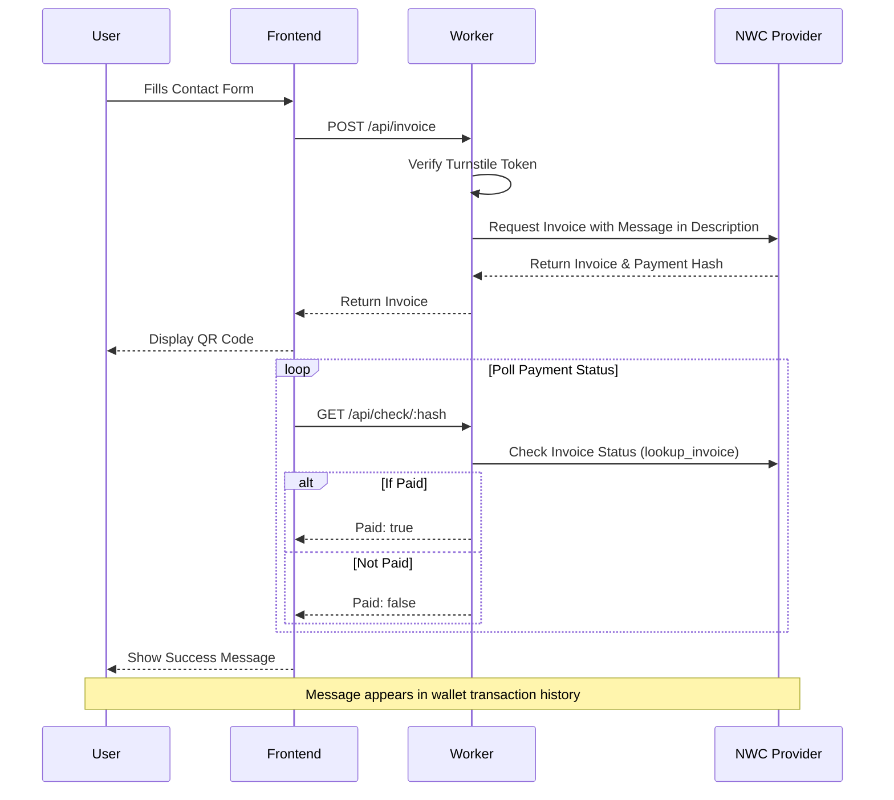
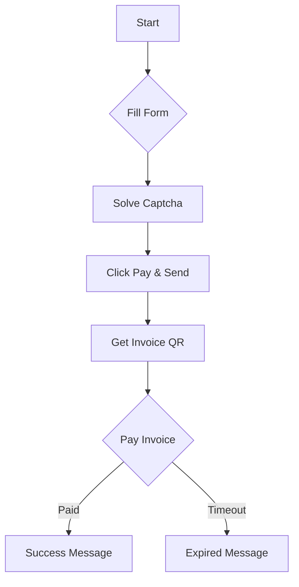

# PayMe - Paid Contact Form

PayMe is a Cloudflare Worker application that allows anyone to send you a message in exchange for a small Bitcoin Lightning Network payment. It uses Nostr Wallet Connect (NWC) to generate invoices and verify payments. Messages are embedded directly in the Lightning invoice description, so you receive them in your wallet's transaction history.

## Features

- **Paid Messaging**: Users must pay a small fee (in sats) to send a message.
- **Lightning Network**: Instant payments via Bitcoin Lightning Network using NWC.
- **Message Delivery**: Messages appear directly in your wallet's transaction history via invoice descriptions.
- **Spam Protection**: Cloudflare Turnstile integration to prevent bot submissions.
- **Serverless**: Runs entirely on Cloudflare Workers - no database required.

## Architecture

The application consists of a frontend (served by the Worker) and a backend API.



### User Flow



## Prerequisites

- **Cloudflare Account**: You need a Cloudflare account to deploy the Worker.
- **Node.js & npm**: For local development and deployment (Node.js v20+ required).
- **Nostr Wallet Connect (NWC) URI**: A connection string from your Lightning wallet (e.g., Alby, Mutiny) that allows `make_invoice` and `lookup_invoice`.
- **Cloudflare Turnstile**: Site Key and Secret Key for bot protection.

## Setup and Configuration

1.  **Clone the repository**
    ```bash
    git clone <repository-url>
    cd payme
    ```

2.  **Install dependencies**
    ```bash
    npm install
    ```

3.  **Configure Wrangler**
    - Update `wrangler.toml` with your specific details.
    - **Important**: Update the `pattern` in `[[routes]]` to match your desired domain (e.g., `contact.yourdomain.com`) or remove the `[[routes]]` block to use the default `*.workers.dev` domain.

4.  **Set Secrets**
    You need to set the following secrets in your Cloudflare Worker:

    ```bash
    # The NWC connection string
    npx wrangler secret put NWC_URI

    # Cloudflare Turnstile Secret Key
    npx wrangler secret put TURNSTILE_SECRET_KEY

    # Cloudflare Turnstile Site Key (can also be in vars if public)
    npx wrangler secret put TURNSTILE_SITE_KEY
    ```

5.  **Environment Variables**
    You can set non-secret variables in `wrangler.toml`:
    - `PRICE_SATS`: The cost to send a message (default: 1000 sats).

## Deployment

Deploy to Cloudflare:
```bash
npm run deploy
```

## Local Development

To run the worker locally:

```bash
npm run dev
```

Note: You will need to have the secrets set locally or in a `.dev.vars` file for local development to work fully.

## License

MIT
